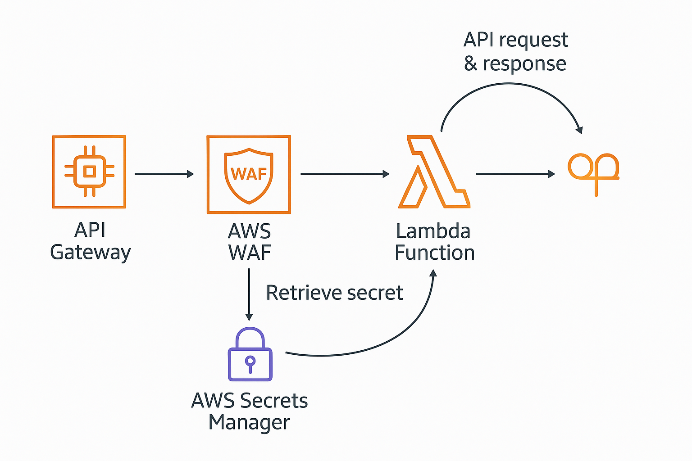

Secure Serverless Application in AWS — Zero Trust & WAF Implementation
Course: Cloud Security (CS-GY 9223, Spring 2025)

🚀 Project Overview
This project demonstrates how to securely deploy a serverless application in AWS using a Zero Trust approach. We focus on enforcing least privilege, API protection, secrets management, and logging using only AWS-native services, all while staying within the free tier.

The solution showcases a RESTful API endpoint powered by AWS Lambda and protected by API Gateway, AWS WAFv2, Secrets Manager, IAM, and Security Hub.

📐 Architecture Diagram

🔧 Technologies Used
AWS Lambda – Stateless compute for request handling

Amazon API Gateway (REST) – Public-facing API interface

AWS WAFv2 – Web firewall to block common web exploits

IAM – Enforces least privilege with scoped execution roles

Secrets Manager – Secure credential storage for the app

CloudWatch – Centralized logging of API + Lambda activity

API Key + Usage Plan – Rate limiting and abuse protection

AWS Security Hub – Continuous compliance and security insights

(AWS Config planned to be enabled for final demo)

✅ Features
Public API: GET /hello?username=YourName

Query param validation with user-friendly error handling

Integration with Secrets Manager (returns fake user info)

WAF rule set (AWSManagedRulesCommonRuleSet)

Throttling enabled (burst limit: 5, rate limit: 2 RPS)

API Key required for access

Real-time logs via CloudWatch

Terraform-managed infrastructure (IaC)

🚀 Deployment
Clone the repo

Navigate to the infra directory

Run:
terraform init
terraform apply

📎 Testing the API
Use the generated API URL after terraform apply. Example:
curl -H "x-api-key: <your-api-key>" "https://<your-api-id>.execute-api.us-east-1.amazonaws.com/prod/hello?username=Anthony"

✅ You should receive a message like:

json
{
  "message": "Hello, Anthony!",
  "retrieved_secret": {
    "username": "testuser",
    "password": "SuperSecurePassword123!"
  }
}

🧪 Abuse Simulation (for demo)
Try accessing without an API key → receive error

Spam using xargs or for loop → triggers WAF/throttle

Pass invalid input like ?username=<script> → test input sanitization

🛡️ Security Controls Summary

Feature	Purpose
WAF	Blocks common exploits (SQLi, XSS, etc.)
API Key & Usage Plan	Controls traffic, prevents abuse
IAM	Least privilege access enforcement
Secrets Manager	Securely handles credentials
Logging	Centralized log trail for API/Lambda
Security Hub	Monitors for misconfigurations and risks
AWS Config (Planned)	Tracks changes, evaluates compliance

🧹 Cleanup (Important!)
To avoid charges after the project demo:

terraform destroy
Also manually delete:

Any Config or Security Hub S3 buckets

Custom secrets from Secrets Manager

📚 Credits
This project was created as part of the final deliverable for CS-GY 9223: Cloud Security, Spring 2025.
